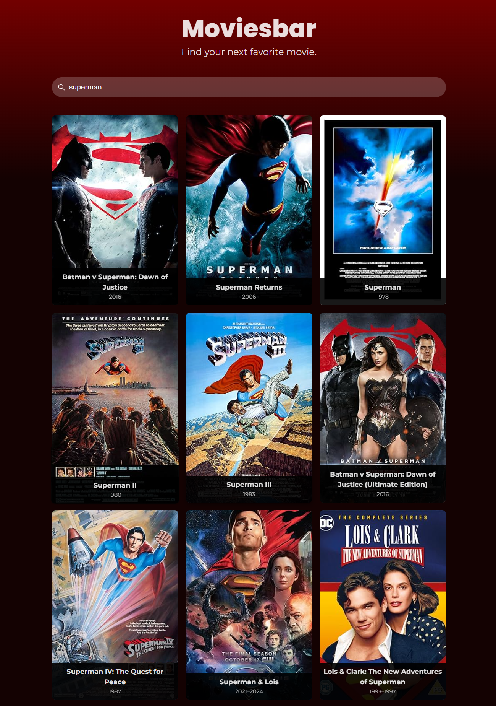

## Movie Search App

This is a simple **Movie Search Application** built using **React** and **Vite**. It allows users to search for movies using the OMDb API and displays movie results in a card layout. The app also includes search functionality and animations on hover using **Framer Motion**.

### Demo

You can view the live version of the app [here](https://main--sparkly-starburst-b5bcd8.netlify.app/).

### Features

- Movie search using the OMDb API
- Responsive design
- Clean, modern UI using Google Fonts
- Hover animations with Framer Motion
- Simple and fast with Vite

### Screenshot

## Technologies Used

- React: JavaScript library for building user interfaces.
- Vite: A fast development environment and build tool.
- OMDb API: Used to fetch movie data.
- Framer Motion: For hover animations on movie cards.
- CSS Grid: For responsive layout.
- Google Fonts: Poppins and Montserrat for typography.

## License

This project is licensed under the MIT License
